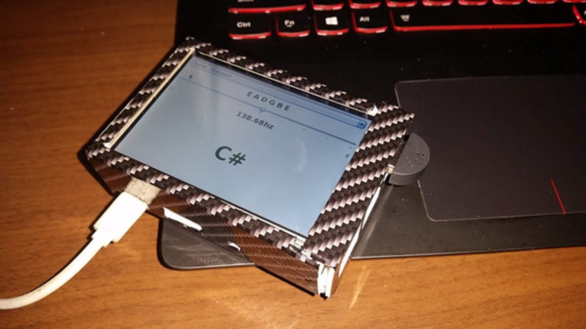

# JavaGuitarTuner
A guitar tuner written in Java to deploy onto a Raspberry Pi. The device was battery powered and protected in a plastic 3D printed case (wrapped in carbon fiber vinyl). When the device was powered-on, it immediately booted into the program to emulate a production guitar tuner as closely as possible. Auto-correlation mathematical techniques were used to analyze and interpret the incoming frequencies.

# Sources
<a href="http://www.psychicorigami.com/2009/01/17/a-5k-java-guitar-tuner/" target="_blank">A 5K Java Guitar Tuner | Psychic Origami</a>

